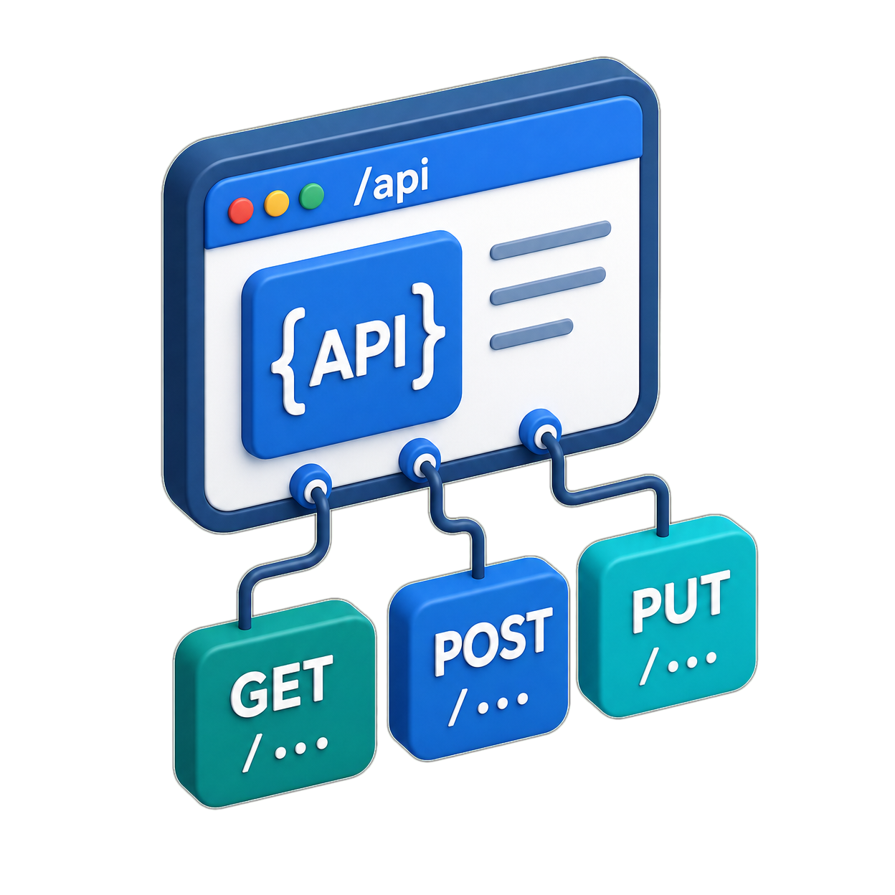

#   Bank Customer Churn Prediction API

##  Integrantes
- Carlos Pascual Peláez
- Nadia Llamoca Cordova

---

##   Descripción

API REST desarrollada con Flask que predice si un cliente bancario de dará de baja el banco (churn) usando un modelo de Machine Learning (Logistc Regression) entrenado con el dataset Bank Customer Churn de Kaggle.

El servicio recibe datos de un cliente, los procesa con el modelo y devuelve una predicción con la **probabilidad de abandono**.

---

##   URLs

| Servicio | URL |
|---|---|
| API (Render) | https://ml-ops-iwax.onrender.com |
| Interfaz (Streamlit) | https://ml-ops-bank-churn-predictor.streamlit.app |
| Repositorio (GitHub) | https://github.com/CPasData/ML-OPS |

---

##  Cómo ejecutar en local
>
## 1. Clonar el repositorio
```bash
git clone https://github.com/CPasData/ML-OPS.git
cd ML-OPS
```

### 2. Crear el entorno virtual
```bash
uv venv
```

### 3. Activar el entorno virtual
```bash
# Windows
.venv\Scripts\activate

# Mac/Linux
source .venv/bin/activate
```

### 4. Instalar dependencias
```bash
uv sync
```

### 5. (Opcional) Reentrenar el modelo
Si quieres regenerar el modelo, ejecuta el notebook `modelado/churn_model.ipynb` completo para generar el archivo `models/random_forest_churn.pkl`

### 6. Ejecutar la API
```bash
python app/app.py
```

La API estará disponible en `http://127.0.0.1:5000`

---

##  Estructura del proyecto

```
ML-OPS/
│
├── app/
│   └── app.py                            ← API Flask
│   └── consumo_app.ipynb                 ← notebook de prueba en local y render de cada petición
│
├── data/
│   └── Bank Customer Churn Prediction.csv
│   └── demo50.csv
│
├── docs/
│   └── demo.ipynb
│   └── Presentacion_Productivizacion.pptx
│
├── img/
│
├── models/
│   └── logistic_regression_churn.pkl     ← modelo seleccionado
│   └── random_forest_churn.pkl           ← modelo entrenado
│
├── notebooks/
│   └── churn_model.ipynb                 ← notebook de entrenamiento
│
├── streamlit/
│   └── streamlit_app.py                  ← Frontend
│
├── requirements.txt
└── README.md
```

---

##  Endpoints

### GET `/health`
Comprueba que la API está funcionando.

**Respuesta:**
```json
{
    "status": "ok",
    "modelo": "Random Forest",
    "descripcion": "API de predicción de Churn bancario funcionando"
}
```

---

### GET `/api/v1/predict/<credit_score>`
Predicción usando el credit score del cliente en la URL.

**Ejemplo:** GET /api/v1/predict/650

**Respuesta:**
```json
{
    "credit_score": 650,
    "churn": 0,
    "resultado": "Se queda",
    "probabilidad_churn": 0.2412
}
```

---

### GET `/api/v1/predict/filter`
Predicción usando parámetros en la query string.

**Ejemplo:** GET /api/v1/predict/filter?age=45&country=Germany&balance=50000

**Respuesta:**
```json
{
    "parametros_recibidos": {
        "age": 45,
        "country": "Germany",
        "balance": 50000.0
    },
    "churn": 1,
    "resultado": "Abandona el banco",
    "probabilidad_churn": 0.6821
}
```

---

### POST `/api/v1/predict`
Predicción completa con todos los datos del cliente en el cuerpo JSON.
Guarda la predicción en la base de datos SQLite.

**Body:**
```json
{
    "credit_score": 721,
    "country": "Spain",
    "gender": "Male",
    "age": 29,
    "tenure": 7,
    "balance": 64000,
    "products_number": 1,
    "credit_card": 1,
    "active_member": 1,
    "estimated_salary": 42500
}
```

**Respuesta:**
```json
{
    "datos_recibidos": {...},
    "churn": 0,
    "resultado": "Se queda",
    "probabilidad_churn": 0.1823
}
```

---

### GET `/api/v1/predicciones`
Devuelve el historial completo de predicciones guardadas en la BD.

**Respuesta:**
```json
{
    "total": 5,
    "predicciones": [...]
}
```

---

### GET `/api/v1/predicciones/count`
Cuenta el total de predicciones realizadas.

**Respuesta:**
```json
{
    "total_predicciones": 5
}
```

---

##  Modelo

| Parámetro | Valor |
|---|---|
| Algoritmo | Random Forest Classifier |
| Dataset | Bank Customer Churn (Kaggle) |
| Features | 10 variables (numéricas y categóricas) |
| Target | churn (0 = se queda, 1 = abandona) |
| ROC-AUC | 0.8595 |
| Balanced Accuracy | 0.7777 |
| Optimización | GridSearchCV con StratifiedKFold (5 folds) |

---

##   Manejo de errores

| Código | Descripción |
|---|---|
| 200 | ✅ Petición correcta |
| 400 | ❌ Datos incorrectos o faltantes |
| 404 | ❌ Ruta no encontrada |
| 500 | ❌ Error interno del servidor |

---

##   Tecnologías

- **Python 3.13**
- **Flask** — API REST
- **scikit-learn** — modelo Random Forest
- **pandas** — procesamiento de datos
- **SQLite** — almacenamiento de predicciones
- **Render** — despliegue de la API
- **Streamlit** — interfaz de usuario